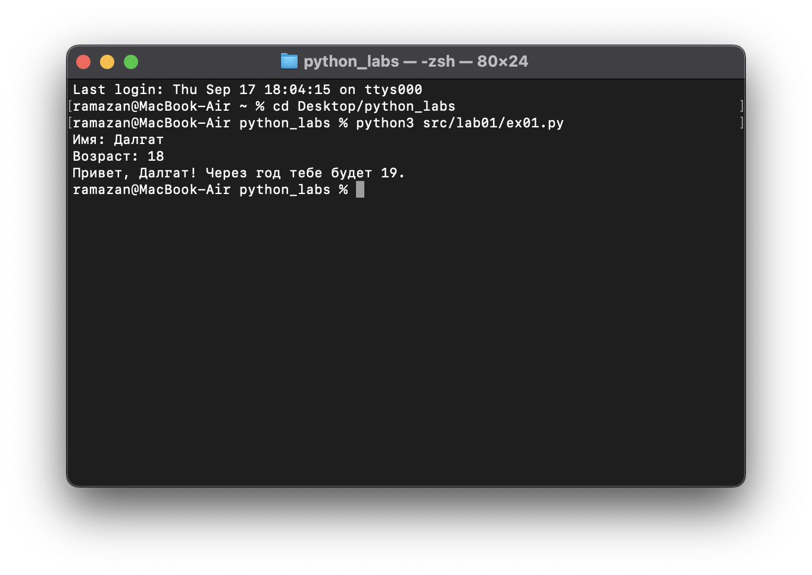
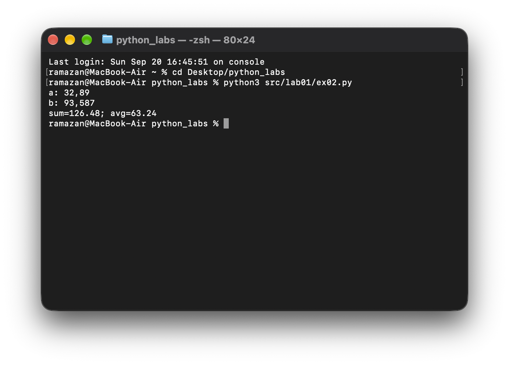
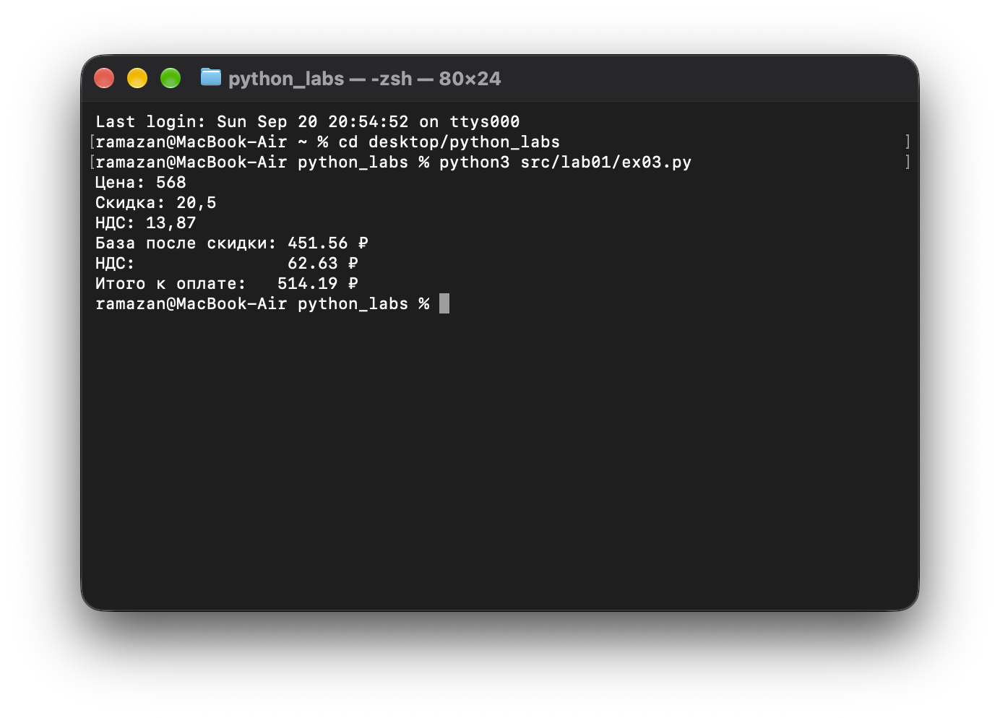
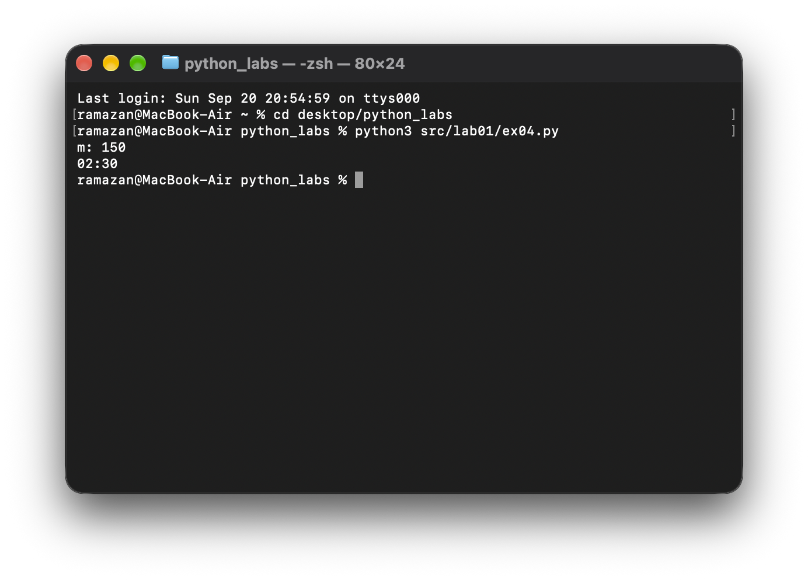
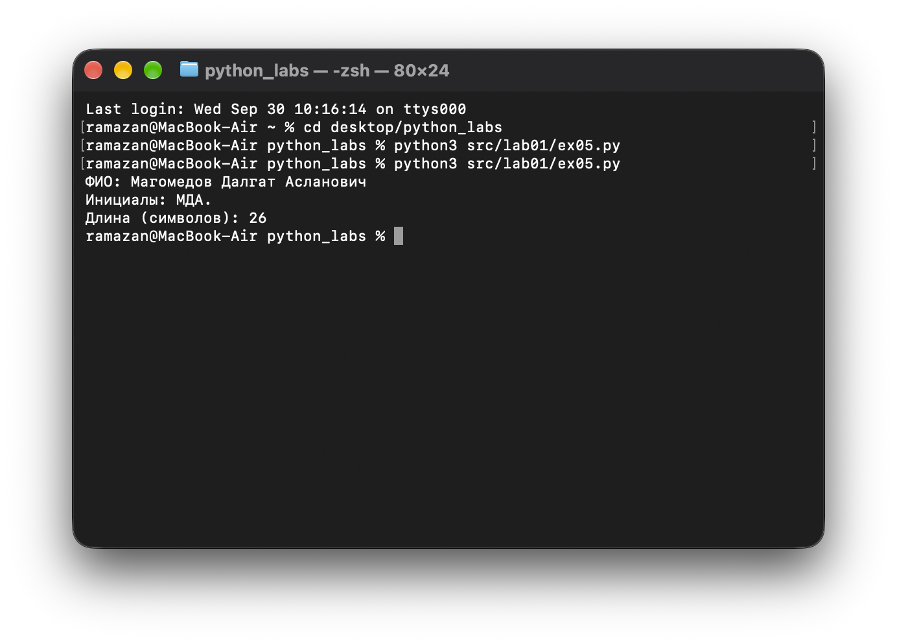

# Лабораторная работа 1. Ввод/вывод и форматирование строк

### Задание 1. Привет и возраст
* **Скрипт:** `ex01.py`
* **Описание:** программа запрашивает имя и возраст, после чего выводит приветствие и возраст через один год.

#### Результат работы:

---

### Задание 2. Сумма и среднее
* **Скрипт:** `ex02.py`
* **Описание:** программа принимает два вещественных числа (с поддержкой точки и запятой), вычисляет их сумму и среднее арифметическое.

#### Результат работы:

---

### Задание 3. Чек: скидка и НДС
* **Скрипт:** `ex03.py`
* **Описание:** расчёт базы после скидки, суммы налога НДС и итоговой стоимости покупки с выравниванием и знаком рубля.

#### Результат работы:

---

### Задание 4. Минуты в ЧЧ:ММ
* **Скрипт:** `ex04.py`
* **Описание:** перевод общего количества минут в формат часов и минут (ЧЧ:ММ) с ведущим нулём.

#### Результат работы:

---

### Задание 5. Инициалы и длина строки
* **Скрипт:** `ex05.py`
* **Описание:** извлечение заглавных инициалов из ФИО и подсчёт длины строки без избыточных пробелов.

#### Результат работы:
